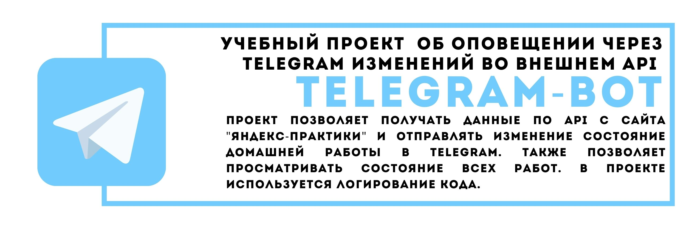

## учебный проект  об оповещении через telegram изменений во внешнем API 

### Краткое описание
Проект позволяет получать данные по API c сайта "Яндекс-практики". Производит проверку и обработку полученных
данных.Формирует сообщение о изменениях и отправляет в telegram. Также позволяет просматривать состояние всех работ командой '/all'. В проекте используется логирование кода.

### Технологии в проекте
- Python 3.7
- python-telegram-bot13.7
### Запуск проекта в dev-режиме

- Установите и активируйте виртуальное окружение
- Установите зависимости из файла requirements.txt

```
pip install -r requirements.txt
``` 

- Создайте файл .env и внесите в него необходимые токены:
PRACTICUM_TOKEN
TELEGRAM_TOKEN
TELEGRAM_CHAT_ID

### Авторы

Максим Бекурин
